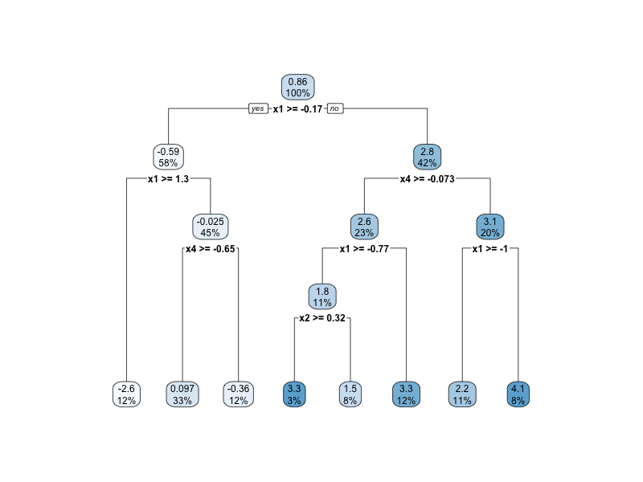

# Honest Causal Tree


**Presenter:** FU Zixuan  & SONG Shuo
**Date:** 2025-06-24

---
## Introduction
- Why study heterogeneous treatment effects?
- Research question: 
  - Estimate heterogeneity by covariates or features.
  - Conduct inference about the magnitude of the differences in treatment effects across subsets of the population.
- Athey and Imbens (2016): a data-driven approach to partition the data.

---
- Contribution:
  - Provide valid CIs w/o restrictions on the number of covariates
or the complexity of the DGP.
  - Discover subpopulations with lower-than-average or higher-than-average treatment effects. 

---
## Estimand
- Object: CATE, $\tau(x)\equiv \mathbb{E}[Y_i(1)-Y_i(0)|X_i=x]$.
  - How **large** is the effect $\tau$ for a specific $x$?
  - How **different** is the effect across $x$?
- After having the estimates: 
  - Improvement on **treatment design** itself.
  - Improvement of **assigment** of treatment.
---
## On a side note

- Causal Trees: focuses on the heterogeneity of treatment effects. How different is subgroup $l_1$ from subgroup $l_2$? Which group is benefiting the most? 
  
- Causal Forests: focuses on consistency and asymptotical normality for treatment effects. It allows for data-driven feature selection all while maintaining the benefits of classical methods (Wager and Athey, 2018)
---
##  Trees: an overview of regression trees

> The best time to plant a tree was 20 years ago. The second best time is now.

1. **Build a tree** (partition) $\pi$ square based on data.
2. Given the tree, **construct an estimator** $\hat{\mu}$ by calculating the mean outcome in each leaf in the tree (box in the square). 

---
## Trees: a walkthrough of the Conventional 

### Sample splitting
1. Split the data into training $S^{tr,tr}$,and validation set $S^{tr,cv}$  and test set $S^{te}$. 
2. Hold out the test set. This is not going to be used in following steps except the final evaluation.
----
### Tree growing

1. Grow the tree $\pi_0$ on the entire traning set $S^{tr}$ fold by minimizing the MSE until the leaves contain a minimum number of samples.
   $$\widehat{\text{MSE}}(S^{tr},S^{tr})= \frac{1}{|S^{tr}|} \sum_{i \in S^{tr}} (Y_i - \hat{\mu}_{\pi}(X_i;S^{tr}))^2$$
where
$$ \hat{\mu}_{\pi}(x;S^{tr}) = \frac{1}{|S^{tr}_l|} \sum_{i \in S^{tr}_l} Y_i, \quad x\in l$$
---
### Tree pruning
1. Get a set of effective $\alpha_k$ to prune the tree $\pi_0$.
2. For one $\alpha_k$. Split the traning set into two parts: $S^{tr,tr}$ and $S^{tr,cv}$. Find the pruned tree $\pi^*$ that minimizes the following.
   $$C_{\alpha_k}(\pi') = \frac{1}{|S^{tr,cv}|} \sum_{i \in S^{tr,cv}} (Y_i - \hat{\mu}_{\pi'}(X_i;S^{tr,tr}))^2+ \alpha_k |\pi'|$$
   
3. Pick the $\alpha_k$ (along with its corresponding pruned tree $\pi_{\alpha_k}$) that gives the smallest cost-complexity measure.
   
---
### Final evaluation
1. Construct the final estimator $\hat{\mu}_{\pi^*}(x;S^{tr})$ based on the optimal tree $\pi^* = \pi_{\alpha_k}$ 
2. Evalute the estimator $\hat{\mu}_{\pi^*}$ on the hidden test set.

---
## A conundrum
We shift our focus from predicting outcome $Y_i$  to predicting effect $\tau_i$. However, while $Y_i$ is observed in the data, the $\tau_i$ is not!

Therefore, we need to adapt the evaluation criteria from $\widehat{\text{MSE}}$ to $\widehat{\text{EMSE}}$.

---
## Adapt the criterion


$$\widehat{\text{MSE}}_\pi(S_1,S_2)=\frac{1}{|S_1|} \sum_{i \in S_1} (Y_i - \hat{\mu}_{\pi}(X_i;S_2))^2$$

$$\text{MSE}_\pi(S_1)=\frac{1}{|S_1|} \sum_{i \in S_1}\mathbb{E}_{S_2} (Y_i - \hat{\mu}_\pi(X_i;S_2))^2 $$
<!-- $$ = \frac{1}{|S_1|} \sum_{i \in S_1}Y_i^2-2{Y_i{\mu}_\pi(X_i)} + \mathbb{E}_{S_2}(\hat{\mu}_\pi(X_i;S_2))^2$$ -->

In the case of conventional,

$$\text{MSE}_\pi=\mathbb{E}_{S}\left\{\frac{1}{|S|} \sum_{i \in S} (Y_i - \hat{\mu}_{\pi}(X_i;S))^2\right\} = \mathbb{E}(Y_i^2) - 2\mathbb{E}(Y_i\hat{\mu}_\pi(X_i;S)) + \mathbb{E}(\hat{\mu}_\pi(X_i;S))^2$$


---


$$ \text{EMSE}_\pi = \mathbb{E}_{S_1,S_2}(\frac{1}{|S_1|} \sum_{i \in S_1} (Y_i - \hat{\mu}_{\pi}(X_i;S_2))^2)$$
$$ = \mathbb{V}_{S_1,S_2}(\hat{\mu}_\pi(X_i;S_2)) - \mathbb{E}_{S_1}(\mu_\pi(X_i))^2 + \mathbb{E}_{S_1}(Y_i^2)$$

---

## Why different set?

We want to make use the independence between sets.
First 
$$ \mathbb{E}\left\{(Y_i-\mu_\pi(X_i)+ \mu_\pi(X_i)-\hat{\mu}_\pi(X_i;S_2))^2 \right\}$$
$$= \mathbb{E}\left\{(Y_i-\mu_\pi(X_i))^2 \right\} + \mathbb{E}\left\{(\mu_\pi(X_i)-\hat{\mu}_\pi(X_i;S_2))^2 \right\}$$

$$+\mathbb{E}_{S_1,S_2}\left\{(Y_i-\mu_\pi(X_i))(\mu_\pi(X_i)-\hat{\mu}_\pi(X_i;S_2)) \right\} $$

---
The third term is zero because 
$$ \mathbb{E}_{S_1}\left\{(Y_i-\mu_\pi(X_i))(\mu_\pi(X_i)-\mathbb{E}_{S_2}\hat{\mu}_\pi(X_i;S_2)) \right\} = 0$$
**where we make use of the independence between $S_1$ and $S_2$!**

The second term is $\mathbb{E}_{S_2}\{\mathbb{V}_{S_1}(\hat{\mu}_\pi(X_i;S_2))\}$

The first term can be simplified to 
$$ \mathbb{E}_{S_1}\left \{(Y_i^2) - 2Y_i\mu_\pi(X_i) + \mu_\pi(X_i)^2\right\}$$
$$ = \mathbb{E}_{S_1}\left \{Y_i^2 - 2\mathbb{E}(Y_i| X_i) \mu_\pi(X_i)+\mu_\pi(X_i)^2\right\}= \mathbb{E}_{S_1}\left\{Y_i^2 - \mu_\pi(X_i)^2\right\}$$

--- 
## Putting it together
We estimate EMSE by the estimating the two components.
$$ \mathbb{E}_{S_2}\{\mathbb{V}_{S_1}(\hat{\mu}_\pi(X_i;S_2))\}, \mathbb{E}_{S_1}[\mu_\pi(X_i)^2]$$

Therefore, we can estimate the EMSE by

$$ \widehat{\text{EMSE}}_\pi(S^{tr},S^{est}) $$


---
Therfore, in the tree growing step, we replace 
$$\widehat{\text{MSE}}_\pi(S^{tr},S^{tr}) \quad 
\text{by} \quad \widehat{\text{EMSE}}_\pi(S^{est},S^{tr})$$

Similarly in the tree pruning step, we replace

$$C_{\alpha_k}(\pi') = \widehat{\text{MSE}}_\pi(S^{tr,cv},S^{tr,tr})+ \alpha_k |\pi'|$$

by
$$C_{\alpha_k}(\pi') = \widehat{\text{EMSE}}_\pi(S^{tr,cv},S^{est})+ \alpha_k |\pi'|$$

---

## The conundrum? 

We adapt the criterion because we don't observe the treatment effect $\tau_i$ directly. But how does it solve the problem?

Then
$$
\widehat{\text{EMSE}}_{\tau}(S^{\text{tr}}, S^{\text{est}}, \Pi) 
\equiv \frac{1}{N_{\text{tr}}} \sum_{i \in S^{\text{tr}}} \hat{\tau}^2(X_i; S^{\text{tr}}, \Pi) $$
$$
- \left( \frac{1}{N_{\text{tr}}} + \frac{1}{N_{\text{est}}} \right)
\cdot \sum_{\ell \in \Pi} \left( \frac{S^{2, \text{tr}}_{\text{treat}}(\ell)}{p} + \frac{S^{2, \text{tr}}_{\text{control}}(\ell)}{1 - p} \right)
$$

---

$$\widehat{\text{EMSE}}_{\mu}(S^{\text{tr}}, N^{\text{est}}, \Pi) 
\equiv \frac{1}{N_{\text{tr}}} \sum_{i \in S^{\text{tr}}} \hat{\mu}^2(X_i; S^{\text{tr}}, \Pi) $$
$$- \left( \frac{1}{N_{\text{tr}}} + \frac{1}{N_{\text{est}}} \right)
\cdot \sum_{\ell \in \Pi} S_{\text{tr}}^2\left(\ell(x; \Pi)\right)
$$

---
## Taking stock
1. Tree splitting **criterion** for treatment effect estimation.
2. Honest tree growing and estimation thus **valid inference** procedure.

---
## Implementation
```r
honestTree <- honest.causalTree(y ~ x1 + x2 + x3 + x4,
    data = train_data,
    treatment = train_data$treatment,
    est_data = est_data,
    est_treatment = est_data$treatment,
    split.Rule = "CT", split.Honest = T, HonestSampleSize = nrow(est_data),
    split.Bucket = T, cv.option = "CT",
    cv.Honest = T
)
opcp <- honestTree$cptable[, 1][which.min(honestTree$cptable[, 4])] # pruning parameter
opTree <- prune(honestTree, opcp) # prune the tree
rpart.plot(opTree) # plot the tree
```
---


<!-- ---
## Other methods

1. Single trees (S-learner, e.g. Imai and Ratkovic (25)): does not split on treatment...
2. Two trees (T-learner, e.g. Foster et al. (24)): split on different features therefore can not compare...
3. Transfrom the LHS variable from outcome into treatment effect
$$Y_i^* = Y_i/p_i *W_i - Y_i/(1-p_i) * (1-W_i) \quad E(Y_i^*|X_i=x) = \tau(x)$$ 
   
---


4. Other splitting criteria: 
   1) split on the outcome, 
   2) split based on some $T$ statistics. -->

---

## Other methods

1. Transformed Outcome Trees: create a pseudo outcome $Y_i^* = Y_i\times\frac{W_i-p}{p(1-p)}$ that encodes the treatment effect, and then run a regular regression tree.
2. Fit-Based Trees: grow a tree by looking at improvement in the outcome fit when allowing treatment effects at the leaves.
3. Squared T-Statistic Trees: split whenever the difference in leaf means is statistically significant.

---
## Conclusion

1. An "honest" data-driven approach.
2. Bridging the gap between predictive machine learning and causal inference.
3. Example.

---


<div align="center">

# Thanks!  


</div>
